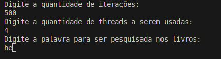
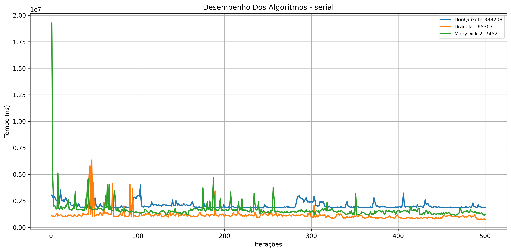
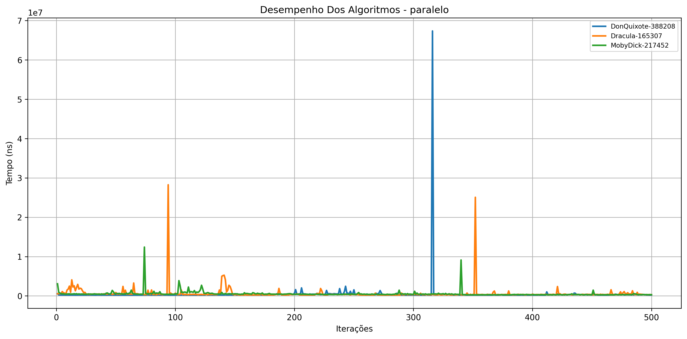
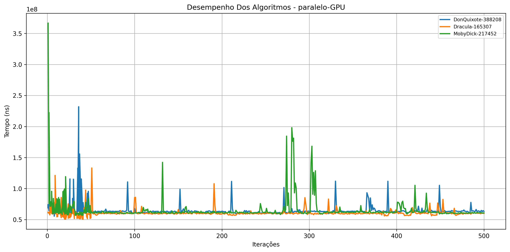

Autor 1: Samir Alves Albano
Autor 2: Leonardo Coelho Martins

link do github: [https://github.com/AlvesAlbano/contagem-palavras](https://github.com/AlvesAlbano/contagem-palavras)

# Como usar 

## 1º Passo

- Instale o [python](https://www.python.org/downloads/)
- rode o seguinte comando no terminal do projeto: `pip install -r requeriments.txt`

## 2º Passo 
- rode o metodo `main` da classe `AppCLI.java`
- Insira o que o programa pede 
- 

- os CSV's de cada livro seram gerados na pasta `src/relatorios`
- os graficos geram gerados na pasta `graficos`

# Resumo
Este trabalho apresenta uma análise comparativa do desempenho de três métodos de contagem
de ocorrências de palavras em textos: uma versão serial em CPU, uma versão paralela em CPU
utilizando 4 threads, e uma versão paralela em GPU baseada em OpenCL, implementada com a
biblioteca jocl-2.0.4. Os experimentos foram realizados processando diferentes arquivos de texto
e repetidos por 500 iterações para reduzir variações e permitir análise estatística. A palavra
buscada em todos os testes foi **he**. Os tempos de execução foram registrados em arquivos
CSV e posteriormente analisados por meio de gráficos gerados em Python. Os resultados
demonstram as diferenças de desempenho entre as abordagens, evidenciando os impactos do
paralelismo em CPU e GPU no processamento de dados textuais.

# Introdução
A busca por eficiência no processamento de grandes volumes de dados torna essencial a
comparação entre diferentes modelos de execução, como métodos seriais, paralelos em CPU e
paralelos em GPU. Neste trabalho, avaliamos três abordagens de contagem de ocorrências de
palavras em Java: uma versão serial, uma versão paralela em CPU utilizando 4 threads, e uma
versão paralela em GPU desenvolvida com OpenCL por meio da biblioteca jocl-2.0.4.jar.
Para a análise, foram utilizados três livros de grande porte (Moby Dick, Dracula e Don Quixote),
todos processados após formatação do texto e buscando a mesma palavra-chave **he**.
Cada método foi executado 500 vezes por arquivo, permitindo uma medição consistente do tempo
de execução. Os resultados foram exportados para arquivos CSV e posteriormente analisados
por gráficos criados em Python. Com isso, o estudo investiga como cada abordagem se comporta
em relação a desempenho, destacando os efeitos do paralelismo em CPU e GPU na execução
de tarefas simples, mas computacionalmente relevantes, como a contagem de palavras em
grandes textos.

# Metodologia
A implementação dos métodos de contagem de palavras foi realizada na linguagem Java,
utilizando a versão 24.0.2 do JDK. Três abordagens distintas foram desenvolvidas: uma versão
serial em CPU, uma versão paralela em CPU utilizando threads e uma versão paralela em GPU
baseada em OpenCL. Para execução na GPU, empregou-se a biblioteca jocl-2.0.4.jar,responsável por toda a interação com o ambiente OpenCL, incluindo criação de contexto, buffers
de memória e execução dos kernels na placa gráfica. Na versão SerialCPU, a contagem foi
realizada de forma sequencial, percorrendo todas as palavras do texto em um único fluxo de
execução. Na versão ParallelCPU, foi utilizado um conjunto fixo de 4 threads, configurado por
meio de um pool de threads, que divide o vetor de palavras em quatro partes iguais e realiza a
contagem de forma concorrente, combinando os resultados ao final. Por fim, a versão
ParallelGPU utilizou um kernel OpenCL capaz de processar todas as palavras simultaneamente
na GPU, explorando o paralelismo massivo desse hardware para acelerar a busca. Os
experimentos foram conduzidos utilizando três arquivos de texto de grande volume (Moby Dick,
Dracula e Don Quixote), previamente normalizados e convertidos para vetores de palavras. A
palavra-chave utilizada em todos os testes foi **he**, convertida para minúsculas para
padronização. Para cada método e para cada arquivo, foram realizadas 500 iterações, conforme
definido pela constante iteracoes, com o objetivo de reduzir a variabilidade estatística causada
por fatores externos do sistema operacional. O tempo total de execução de cada iteração foi
medido em nanossegundos e armazenado em arquivos CSV individuais, separados por método
e por arquivo de entrada. Esses resultados foram posteriormente analisados em Python, onde
foram gerados gráficos comparativos utilizando bibliotecas como matplotlib e pandas. Os gráficos
permitem observar tendências de desempenho ao longo das 500 repetições. A partir dessa coleta
sistemática de dados, foi possível avaliar de forma consistente o impacto das três abordagens
sobre o tempo de execução da tarefa de contagem de palavras, considerando tanto o paralelismo
leve da CPU quanto o paralelismo massivo da GPU.

# Resultados e Discussão
Este estudo buscou compreender o desempenho relativo dos algoritmos de busca em ambientes
seriais e paralelos com CPU e GPU, avaliar quais meios de processamento são mais adequados
para diferentes volumes de dados e analisar o impacto do tamanho do conjunto de entrada e do
meio de processamento sobre o desempenho. Além disso, os arquivos CSV gerados permitiram
uma análise visual clara por meio de gráficos, facilitando comparações e futuras análises.
Foram realizados testes de desempenho aplicando os três métodos - SerialCPU, ParallelCPU (4
threads) e ParallelGPU (OpenCL/JOCL) sobre três textos de grande porte: Don Quixote, Dracula
e Moby Dick. Cada método foi executado 500 vezes, e os tempos médios de execução (em
nanossegundos) foram obtidos a partir dos arquivos CSV gerados automaticamente pelo sistema.

## Médias obtidas

| Método                      | Don Quixote (ns) | Dracula (ns) | Moby Dick (ns) |
|-----------------------------|------------------|--------------|----------------|
| Serial CPU                  | 1.269.198,4      | 29.544,2     | 1.334.066,8    |
| Paralelismo CPU (4 threads) | 393.915,4        | 395.399,8    | 436.148,8      |
| Paralelismo GPU (OpenCL)    | 116.264.862,6    | 110.620.706,0| 123.820.640,8  |

# Análise dos Métodos
Nesta subseção, são apresentados os gráficos referentes ao tempo de execução de cada método
(SerialCPU, ParallelCPU e ParallelGPU) ao longo das 500 iterações para os três textos utilizados.
A análise gráfica permite observar como o tamanho e a natureza do conjunto de dados
influenciam o desempenho dos algoritmos. Além disso, possibilita verificar se o comportamento
experimental está de acordo com as expectativas teóricas sobre paralelismo e sobre a execução
sequencial de tarefas simples como a contagem de palavras em textos grandes.

## Método Serial
A versão serial apresentou desempenho proporcional ao tamanho dos textos, com Dracula sendo
o mais rápido e Moby Dick e Don Quixote mostrando tempos mais elevados devido à maior
quantidade de palavras. Esse comportamento é esperado, pois toda a execução ocorre em um
único fluxo de controle, percorrendo sequencialmente todas as palavras.

## Método CPU Paralelo (4 threads)
A versão paralela em CPU apresentou desempenho significativamente superior ao método serial.
A redução do tempo médio foi aproximadamente 3 vezes mais rápida para Don Quixote e Moby
Dick e aproximadamente 1,1vezes mais rápido para Dracula (texto menor). O uso de quatro
threads permitiu dividir o vetor em partes iguais, diminuindo a carga de trabalho por thread e
reduzindo os gargalos típicos da execução sequencial. Como consequência, os tempos dos três
livros ficaram próximos, indicando que o paralelismo reduz o impacto do tamanho do texto.

## Método GPU Paralelo (OpenCL)
A implementação paralela em GPU apresentou desempenho muito inferior às outras versões,
com tempos cerca de 300× maiores que o método paralelo em CPU. Isso ocorre devido ao alto
overhead da GPU: criação do contexto OpenCL, alocação e transferência dos buffers,
sincronização entre host e dispositivo e kernel simples, com poucas operações por unidade de
dado. Como o problema consiste apenas em comparar palavras, uma operação extremamente
leve, a GPU não consegue compensar o custo de comunicação. Assim, apesar da capacidade
massiva de paralelismo da GPU, o tipo de tarefa não se beneficia dessa arquitetura.

# Análise Gráfica
Três gráficos foram gerados: serial.png, paralelo.png e paralelo-GPU.png. Cada gráfico mostra o
tempo de execução ao longo das 500 iterações, com três curvas representando os textos
utilizados.

## Serial

As curvas mostram variação consistente com o tamanho dos arquivos, sendo Dracula
o mais rápido e Moby Dick e Don Quixote significativamente mais lentos.

## Paralelo

Os tempos ficam muito próximos entre os três textos, demonstrando que a divisão
por threads reduz a influência do tamanho do conjunto de dados. O gráfico é visualmente muito
mais “baixo” e estável do que o gráfico serial.

## Paralelo na GPU

As curvas se mantêm extremamente elevadas, refletindo os altos tempos
médios. Observa-se pouca variação entre os textos, indicando que o overhead domina totalmente
o tempo de execução, tornando a operação praticamente independente do tamanho do arquivo.

# Conclusão
Este Este trabalho permitiu analisar o impacto da paralelização na eficiência de algoritmos de
contagem de palavras em grandes textos. A comparação entre as versões Serial CPU, Paralelo
CPU (4 threads) e Paralelo GPU (OpenCL) mostrou claramente como cada abordagem se
comporta diante de diferentes volumes de dados. O Paralelo CPU foi o método mais eficiente,
demonstrando que algoritmos com operações simples por elemento se beneficiam de
paralelização leve em múltiplos núcleos. O Serial CPU apresentou desempenho intermediário,
adequado para tarefas de menor porte, mas limitado para textos de maior tamanho. Já o Paralelo
GPU mostrou-se a abordagem menos adequada para esta tarefa, evidenciando que GPUs só
entregam ganhos significativos quando o custo de computação por elemento supera o overhead
de comunicação e gerenciamento de memória, o que não ocorre na contagem de palavras
simples. Essas observações reforçam que a escolha entre CPU e GPU não depende apenas da
quantidade de dados, mas também da complexidade da operação, do overhead de comunicação
e do modelo de execução da arquitetura utilizada. De forma geral, conclui-se que o paralelismo
em CPU é uma estratégia eficiente para otimizar tarefas simples em grandes volumes de dados
textuais, enquanto o uso de GPU deve ser reservado para problemas com alta densidade
computacional por elemento. Os resultados obtidos fornecem insights valiosos para
desenvolvedores e pesquisadores interessados em computação concorrente e paralela,
evidenciando a importância de escolher a abordagem adequada de acordo com a natureza da
tarefa.

# Referências
JOCL. Java bindings for OpenCL. Disponível em: http://www.jocl.org/. Acesso em: 20 out. 2025.
MELVILLE, H. *Moby Dick*. 1851. Disponível em: https://www.gutenberg.org/ebooks/2701.
Acesso em: 20 out. 2025.
STOKER, B. *Dracula*. 1897. Disponível em: https://www.gutenberg.org/ebooks/345. Acesso
em: 20 out. 2025.
CERVANTES, M. de. *Don Quixote*. 1605. Disponível em:
https://www.gutenberg.org/ebooks/996. Acesso em: 20 out. 2025.
STONE, J.; G. GRAHAM; B. KOWALSKI. *OpenCL Programming Guide*. Addison-Wesley,
2012.
GOETZ, B.; B. BODIN; J. BROOKS. *Java Concurrency in Practice*. Addison-Wesley, 2006.
PYTHON SOFTWARE FOUNDATION. Python Language Reference. Disponível em:
https://www.python.org/. Acesso em: 20 out. 2025.